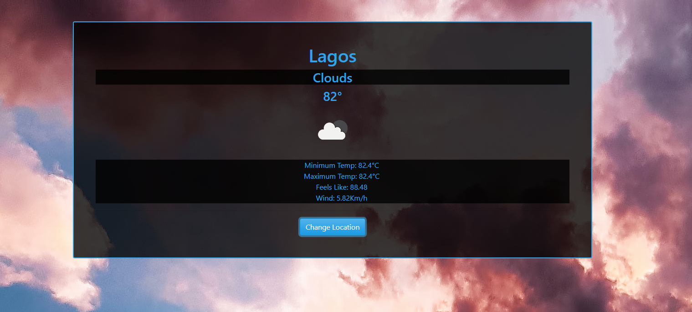

# Javascript Weather-App

> This is part of the Weather-App Project in [The Odin Project's](https://www.theodinproject.com/courses/javascript/lessons/weather-app?ref=lnav) Javascript Curriculum.

 View the app live [here](https://taiwocoker.github.io/Weather-App/)
 
## Built With

- Javascript, HTML and CSS
- VSCode, Linters

## Getting Started

To get a local copy up and running follow these simple example steps.

- Clone the repository and there you go! ;-)

### Prerequisites

- Get a browser like Chrome and Firefox in their most recent versions

### Setup

- git clone https://github.com/taiwocoker/Weather-App.git
- cd WeatherApp
- Copy the absolute path of the index file, paste on your browser and click on enter

### for webpack run:

$ npm run build

### Install

- Install VSCode or any code editor you like

## Author

👤 **Taiwo Coker**

- Github: [@githubhandle](https://github.com/taiwocoker)
- Twitter: [@twitterhandle](https://twitter.com/SelloCoker)
- Linkedin: [linkedin](https://linkedin.com/in/taiwo-coker)

## 🤝 Contributing

Contributions, issues and feature requests are welcome!

Feel free to check the [issues page](https://github.com/taiwocoker/Weather-App/issues).

## Show your support

Give a ⭐️ if you like this project!

